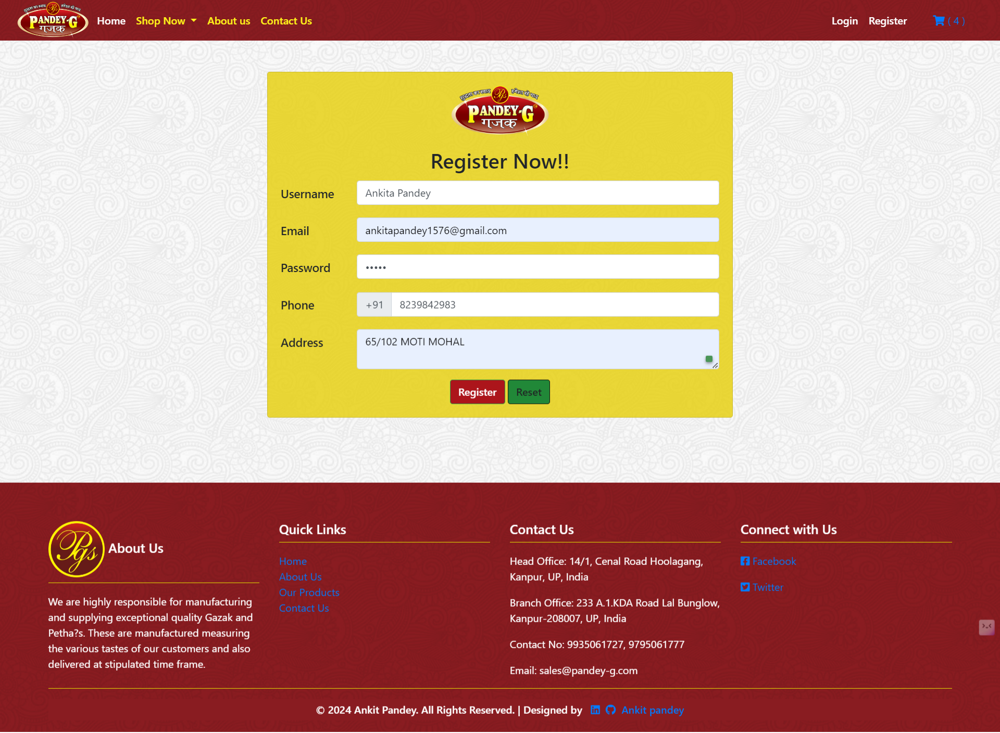
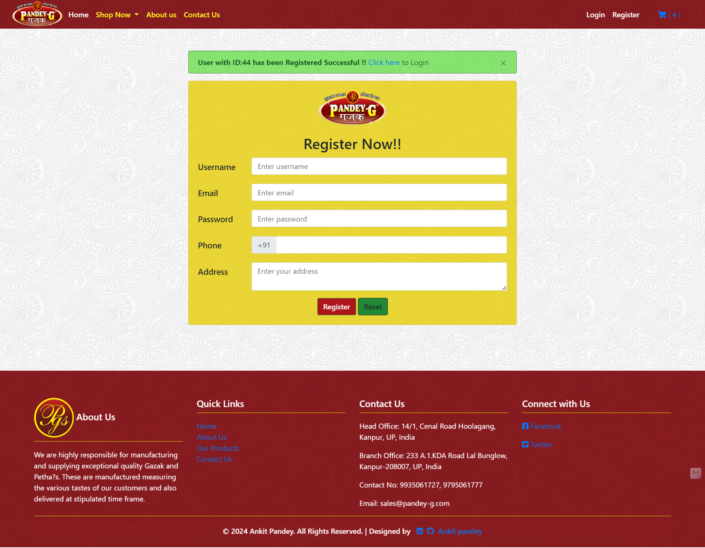
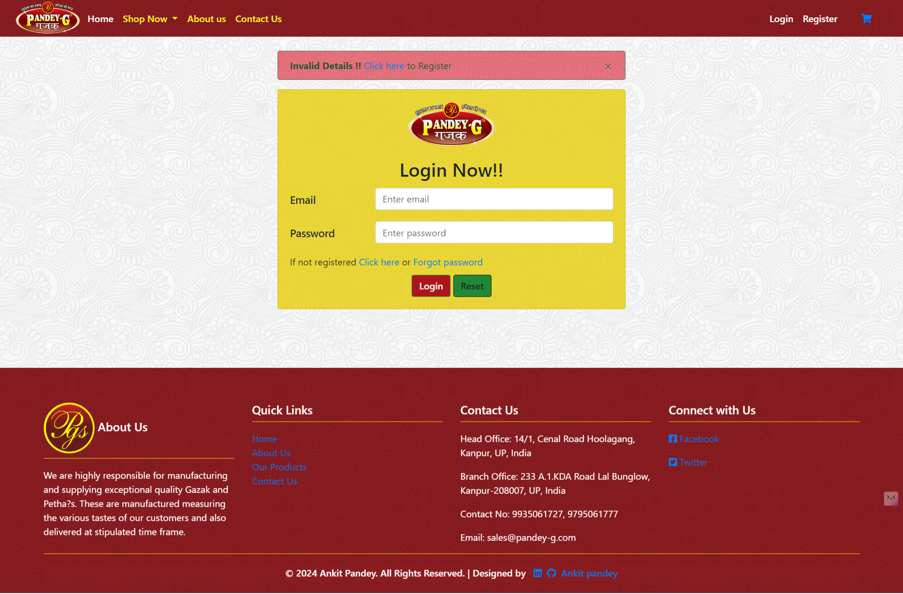
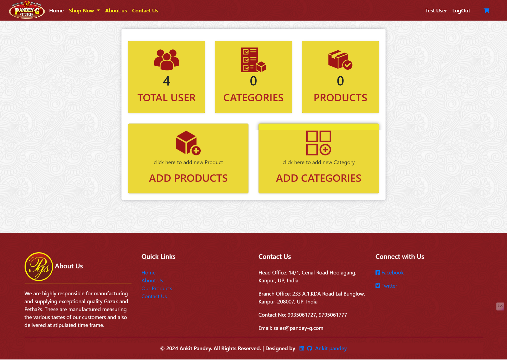
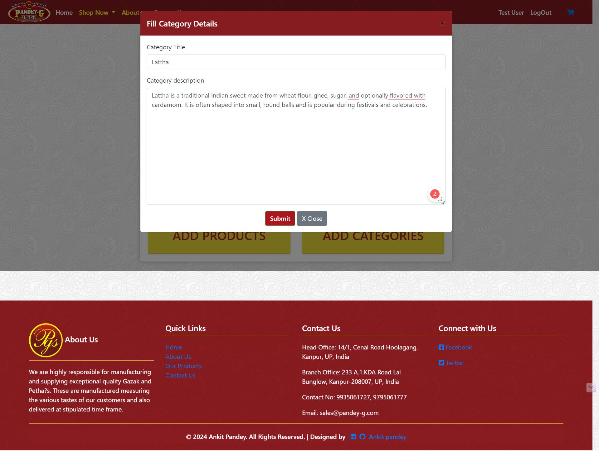
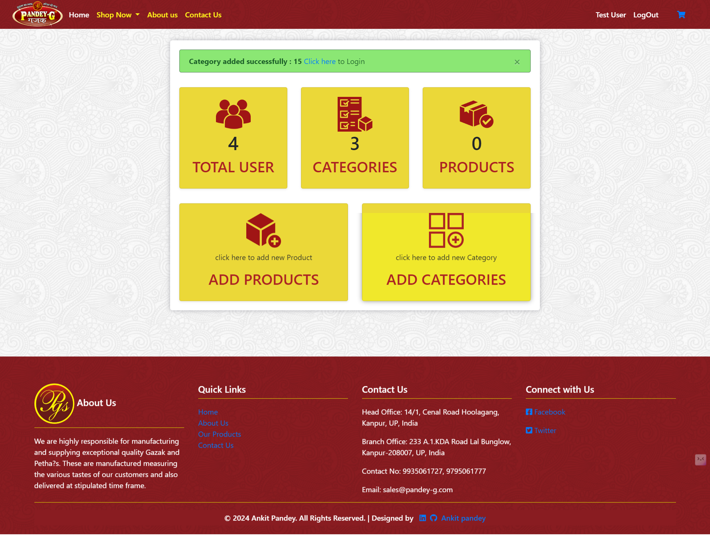
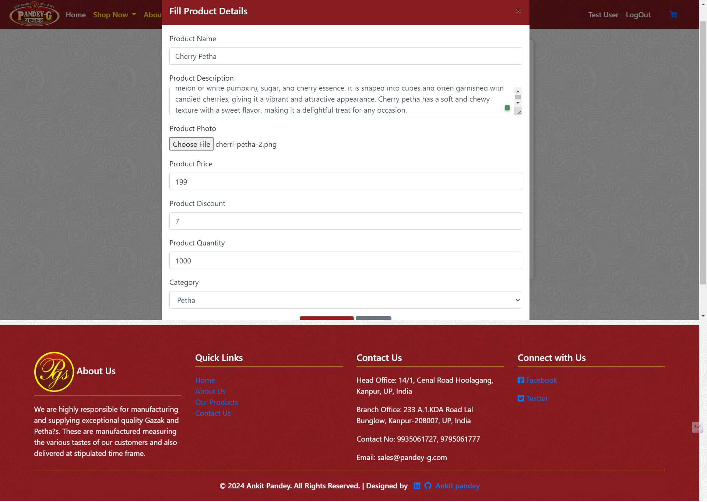
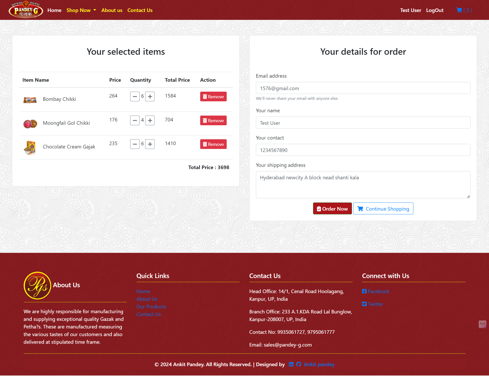
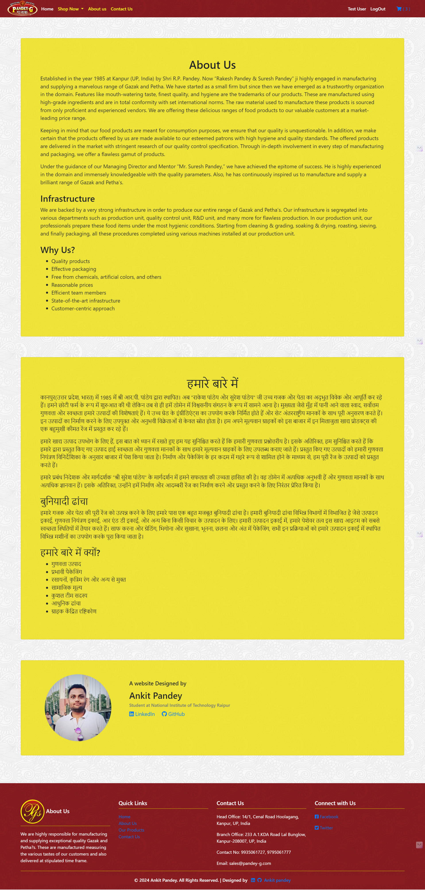
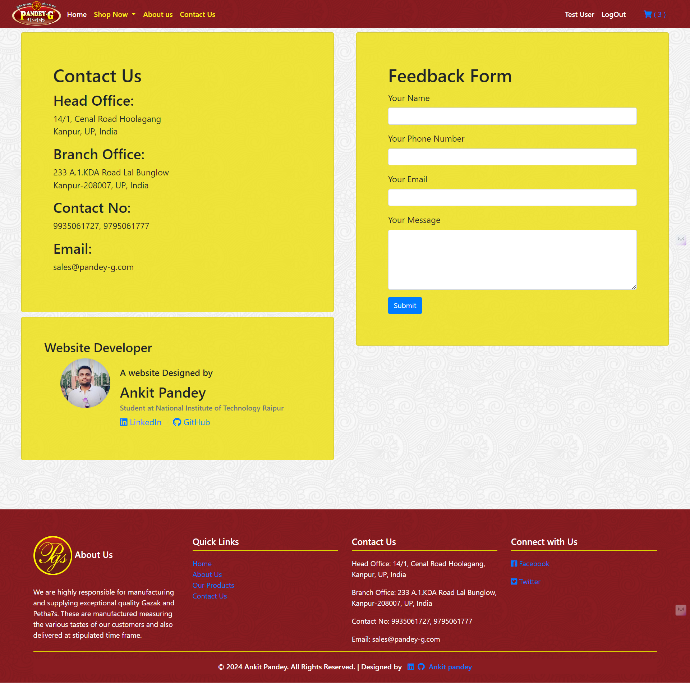

Your README.md looks good overall, but I'll make a few adjustments for clarity and correctness:

---

# E-Commerce Website Project

This project is an e-commerce website developed using Java Servlets, JSP, HTML, CSS, Bootstrap, and Hibernate. It allows users to browse products, add them to the cart, and purchase them online. The website includes features for user authentication, product management, and order processing.

## Project Structure

- **Database:** MySQL database is used to store product, user, and order information. The database schema is provided in the `database.sql` file.
- **Backend:** Java Servlets are used to handle HTTP requests and process business logic. Hibernate is used as an ORM (Object-Relational Mapping) tool to interact with the database.
- **Frontend:** JSP pages are used for the user interface. Bootstrap is used for styling.

## Features

- User Registration and Login: Users can create an account and log in to access the website.
- Product Management: Admin users can add, edit, and delete products.
- Shopping Cart: Users can add products to their cart and proceed to checkout.
- Order Processing: Users can place orders and view their order history.
- Responsive Design: The website is mobile-friendly and adjusts to different screen sizes.

## How to Run

1. **Database Setup:** 
   - Create a MySQL database and import the schema from `DBpandeyji.sql`.
   - Update the database connection settings in `hibernate.cfg.xml`.

2. **Hibernate Configuration:**
   - Configure Hibernate mapping files for entities and update the `hibernate.cfg.xml` file.

3. **Deployment:**
   - Deploy the project to a servlet container like Apache Tomcat.
   - Access the website using the deployed URL (e.g., `http://localhost:8080/store/`).

## Project Structure

```
./
├── src/
│   ├── main/
│   │   ├── java/
│   │   │   └── com/
│   │   │       └── learn/
│   │   │           └── mycart/
│   │   │               ├── dao/
│   │   │               │   ├── CategoryDao.java
│   │   │               │   ├── ProductDao.java
│   │   │               │   └── UserDao.java
│   │   │               ├── entities/
│   │   │               │   ├── Category.java
│   │   │               │   ├── Product.java
│   │   │               │   └── User.java
│   │   │               └── servlets/
│   │   │                   ├── LoginServlet.java
│   │   │                   ├── LogoutServlet.java
│   │   │                   ├── ProductOperationServlet.java
│   │   │                   ├── RegisterServlet.java
│   │   │                   └── UpdateProfileServlet.java
│   │   └── webapp/
│   │       ├── Components/
│   │       │   ├── Footer.jsp
│   │       │   ├── common_css_js.jsp
│   │       │   ├── common_modals.jsp
│   │       │   ├── crousal.jsp
│   │       │   ├── message.jsp
│   │       │   └── navbar.jsp
│   │       ├── META-INF/
│   │       │   └── context.xml
│   │       ├── WEB-INF/
│   │       │   ├── beans.xml
│   │       │   └── web.xml
│   │       ├── css/
│   │       │   ├── admin.css
│   │       │   ├── checkout.css
│   │       │   ├── home.css
│   │       │   ├── login.css
│   │       │   ├── navbar.css
│   │       │   └── register.css
│   │       └── js/
│   │           ├── about.jsp
│   │           ├── aboutus.jsp
│   │           ├── admin.jsp
│   │           ├── checkout.jsp
│   │           ├── contactus.jsp
│   │           ├── index.jsp
│   │           ├── login.jsp
│   │           ├── normal.jsp
│   │           ├── profile.jsp
│   │           ├── register.jsp
│   │           └── updateProfile.jsp
└── target/
    └── classes/
        ├── META-INF/
        │   ├── hibernate.cfg.xml
        │   └── persistence.xml
        └── com/
            └── learn/
                └── mycart/
                    ├── dao/
                    │   ├── CategoryDao.class
                    │   ├── ProductDao.class
                    │   └── UserDao.class
                    ├── entities/
                    │   ├── Category.class
                    │   ├── Product.class
                    │   └── User.class
                    ├── helper/
                    │   ├── FactoryProvider.class
                    │   └── Helper.class
                    └── servlets/
                        ├── LoginServlet.class
                        ├── LogoutServlet.class
                        ├── ProductOperationServlet.class
                        ├── RegisterServlet.class
                        └── UpdateProfileServlet.class
```

## Technologies Used
- Java Servlet
- JSP
- HTML
- CSS
- Bootstrap
- Hibernate
- MySQL

---
Certainly! Here's an example README.md file for some important folders in your project:

---

# Project Structure Overview

This repository contains the source code for an e-commerce website. Below is an overview of the most important folders and their contents:

## `src/main/java/com/learn/mycart/dao`

This folder contains Data Access Object (DAO) classes responsible for interacting with the database. The important files are:

- `CategoryDao.java`: Handles database operations related to product categories.
- `ProductDao.java`: Handles database operations related to products.
- `UserDao.java`: Handles database operations related to users.

## `src/main/java/com/learn/mycart/entities`

Contains entity classes representing database tables. Key files include:

- `Category.java`: Entity class for product categories.
- `Product.java`: Entity class for products.
- `User.java`: Entity class for users.

## `src/main/java/com/learn/mycart/helper`

Contains helper classes and utilities. Notable files are:

- `FactoryProvider.java`: Provides database session factory for Hibernate.
- `Helper.java`: General-purpose helper methods.

## `src/main/java/com/learn/mycart/servlets`

Contains servlet classes that handle HTTP requests. Important servlets are:

- `LoginServlet.java`: Handles user login functionality.
- `LogoutServlet.java`: Handles user logout functionality.
- `ProductOperationServlet.java`: Performs operations on products (e.g., add, edit, delete).
- `RegisterServlet.java`: Handles user registration.
- `UpdateProfileServlet.java`: Handles updating user profiles.

## `src/main/resources`

Contains resource files, including database configuration. Key files include:

- `META-INF/persistence.xml`: Configuration file for JPA persistence.
- `hibernate.cfg.xml`: Configuration file for Hibernate.

## `webapp`

Contains web application resources such as JSP files, CSS, JavaScript, and images. Important folders are:

- `WEB-INF`: Contains configuration files and JSP files.
- `css`: Contains CSS files for styling the website.
- `images`: Contains images used in the website.
- `js`: Contains JavaScript files.

---

# Screenshots

## Registration Module




### Users in Database


## Login Module


## Nav bar


## Footer


## Login as Admin


## Add Category (Admin) 




## Add Product (Admin)




## Index.jsp page with Login 


## Toast Notifications


## Dynamic Category fetch


()

## Dynamic Checkout Modal


## CheckOut Page



## About Us page



## Contact Us Page



